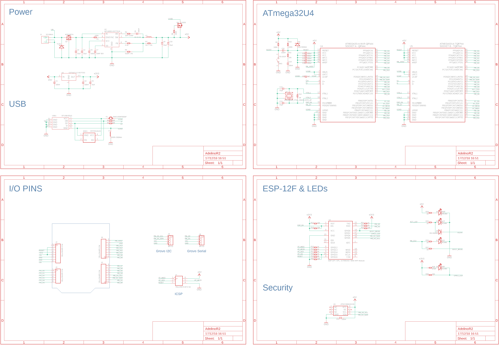
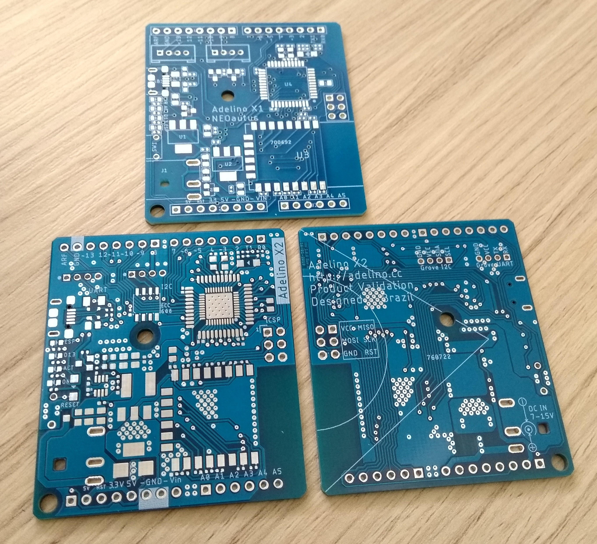

= Adelino
:page-layout: book

Adelino is an ATmega32U4 development board with integrated ESP-12F module for WiFi capabilities.

It's inspired by Arduino Leonardo and Arduino Yún, with changes regarding integration, firmware and board size.

== Adelino X1

Adelino X1 is the first version of the board, aimed to test integration, assembling process, firmware and the overall concept. This PCB was assembled by SeeedStudio.

image::Adelino_X1.jpg[Adelino X1]

== Adelino X2

Adelino X2 features https://www.microchip.com/wwwproducts/en/ATECC608A[ATECC608] cryptographic co-processor chip onboard (with secure hardware-based key storage), adds a full high speed SPI bridge between ESP-8266 and ATmega32U4 and a more efficient switching power supply. It also changes the GPIO Grove port to Serial and improves the compatibility with standard Arduino Leonardo libraries.

These are Adelino X2 PCBs front and back sides, compared with Adelino X1. They just arrived from Seeed Studio. Soon we'll get Adelino X2 assembled boards. Notice the nested ATmega32U4 footprints, for QFN44 (smaller and cheaper) and TQFP44 (bigger and $2 more expensive).

== Copyright

image:https://i.creativecommons.org/l/by-nd/4.0/88x31.png[]

This work is licensed under a http://creativecommons.org/licenses/by-nd/4.0/[Creative Commons Attribution-NoDerivatives 4.0 International License].

