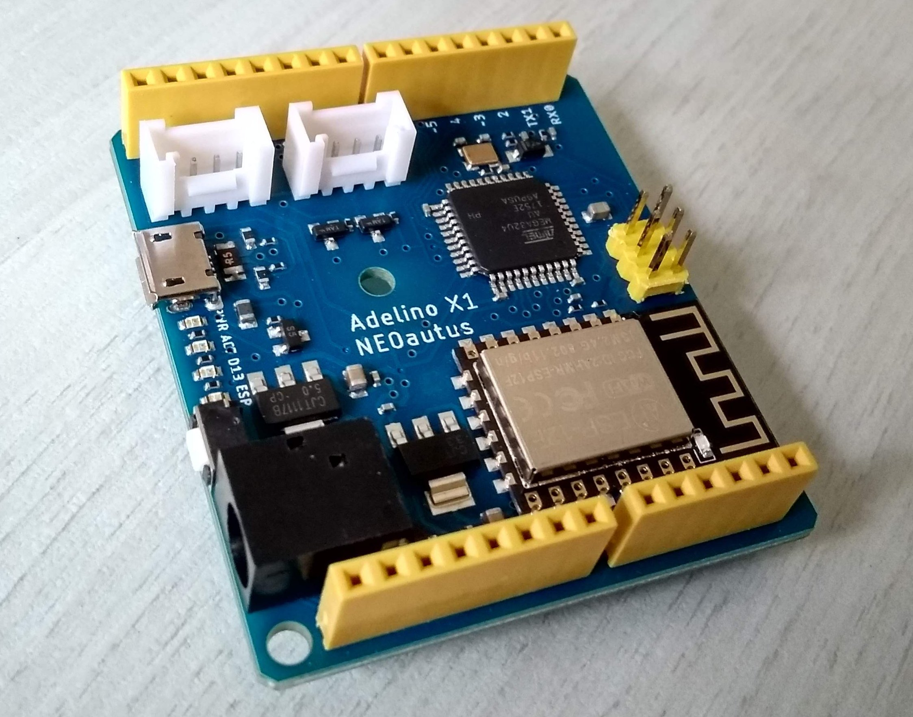

= Adelino
:page-layout: book

Adelino is an ATmega32U4 development board with integrated ESP-12F module for WiFi capabilities.

It's inspired by Arduino Leonardo and Arduino Yún, with changes regarding integration, firmware and board size.

== Adelino X1

Adelino X1 is the first version of the board, aimed to test integration, assembling process, firmware and the overall concept. This PCB was assembled by SeeedStudio.

== Copyright

image:https://i.creativecommons.org/l/by-nd/4.0/88x31.png[]

This work is licensed under a http://creativecommons.org/licenses/by-nd/4.0/[Creative Commons Attribution-NoDerivatives 4.0 International License].

